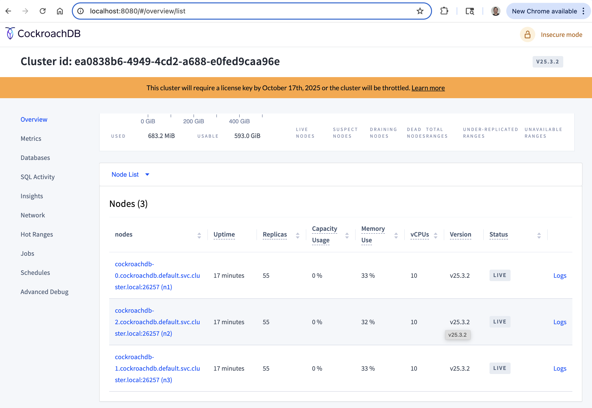
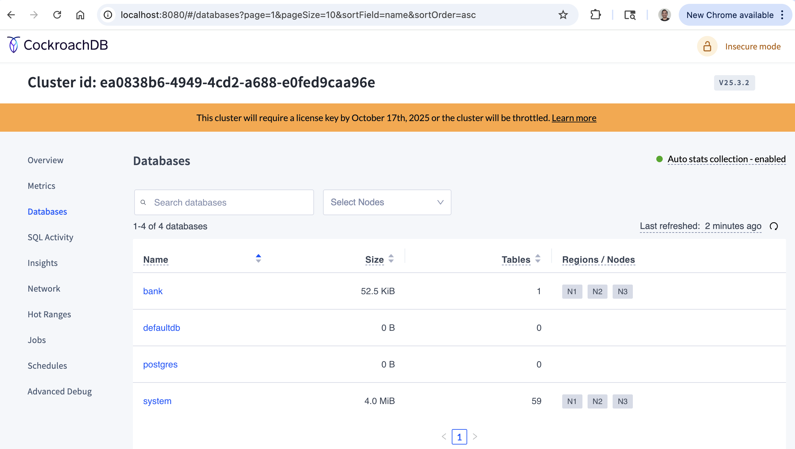

# Launch and Initialize CRDB

As part of this exercise, you will cover below task

- [Build a local 3 node Kubernetes cluster using KinD](#build-a-local-3-node-kubernetes-cluster-using-kind)

- [Deploy 3 node CockroachDB cluster running within Kubernetes](#deploy-3-node-cockroachdb-cluster-running-within-kubernetes)

- [Use built-in SQL client using a temporary interactive pod to test CockroachDB cluster](#use-built-in-sql-client-using-a-temporary-interactive-pod-to-test-cockroachdb-cluster)

- [Access CockroachDB Web console](#access-cockroachdb-web-console)

- [Setup NGINX Ingress Controller as load balancer to expose CockroachDB outside of Kubernetes](#setup-nginx-ingress-controller-as-load-balancer-to-expose-cockroachdb-outside-of-kubernetes)

- [Expose CockroachDB service using NGINX](#expose-cockroachdb-service-using-nginx)

- [Test running a query from your host machine outside of kubernetes](#test-running-a-query-from-your-host-machine-outside-of-kubernetes)

</br>

## Build a local 3 node Kubernetes cluster using KinD

1. Install KinD (<https://kind.sigs.k8s.io/docs/user/quick-start/#installation>).

    ```bash
    brew install kind
    ```

1. Creating Kind cluster. Find the latest image of Kind from dockerhub (<https://hub.docker.com/r/kindest/node/tags>). Create your Kind config file accordingly.

    ```bash
    kind create cluster --config kind/3node-config.yaml
    ```

1. Setup kubernetes context

    ```bash
    kubectl cluster-info --context kind-crdb-3node-cluster
    ```

1. validate 3 node kubernetes cluster is running

    ```bash
    kubectl get nodes
    ```

## Deploy 3 node CockroachDB cluster running within Kubernetes

Follow below guide (<https://www.cockroachlabs.com/docs/v25.3/orchestrate-a-local-cluster-with-kubernetes-insecure>) for details.

1. Change directory to the `<project_working_dir>/cockroachdb`

    ```bash
    cd cockroachdb
    ```

1. Download the `cockroachdb-statefulset.yaml` file and apply it.

    ```bash
    curl -O https://raw.githubusercontent.com/cockroachdb/cockroach/master/cloud/kubernetes/cockroachdb-statefulset.yaml
    ```

1. Modify the resource allocation to below for the statefulsets

    ```yaml
    resources:
          requests:
            cpu: "500m"
            memory: "2Gi"
          limits:
            cpu: "500m"
            memory: "2Gi"
    ```

1. Once done apply the yaml manifest to create the objects

    ```bash
    kubectl apply -f cockroachdb-statefulset.yaml
    ```

    ```bash
    ##Sample Output##

    service/cockroachdb-public created
    Warning: spec.SessionAffinity is ignored for headless services
    service/cockroachdb created
    poddisruptionbudget.policy/cockroachdb-budget created
    statefulset.apps/cockroachdb created
    ```

1. Confirm that the persistent volumes and corresponding claims were created successfully for all three pods:

    ```bash
    kubectl get pv
    ```

    ```bash
    ##Sample Output##

    NAME                                       CAPACITY   ACCESS MODES   RECLAIM POLICY   STATUS   CLAIM                           STORAGECLASS   VOLUMEATTRIBUTESCLASS   REASON   AGE
    pvc-055bff24-c965-47b0-aeb0-b7a44a271d09   20Gi       RWO            Delete           Bound    default/datadir-cockroachdb-2   standard       <unset>                          37h
    pvc-998d8a5c-dfdb-488c-a68f-8bc5974fe7da   20Gi       RWO            Delete           Bound    default/datadir-cockroachdb-0   standard       <unset>                          37h
    pvc-c4471569-0938-464d-9008-2733a20da1b1   20Gi       RWO            Delete           Bound    default/datadir-cockroachdb-1   standard       <unset>                          37h
    ```

1. Confirm that three pods are Running successfully

    ```bash
    kubectl get pods
    ```

    ```bash
    ##Sample Output##

    NAME            READY   STATUS    RESTARTS   AGE
    cockroachdb-0   0/1     Running   0          2m12s
    cockroachdb-1   0/1     Running   0          2m12s
    cockroachdb-2   0/1     Running   0          2m12s
    ```

    Initially the container within the pod would not be in ready state. This is because the all the cockroach nodes have not been joined into a cluster. This is accomplished by running `cockroach init` command which you are going to do in the next step.

1. Use `cluster-init.yaml` file to perform a one-time initialization by running `cockroach init` command that joins the CockroachDB nodes into a single cluster:

    ```bash
    curl -O https://raw.githubusercontent.com/cockroachdb/cockroach/master/cloud/kubernetes/cluster-init.yaml
    ```

    ```bash
    kubectl create -f cluster-init.yaml
    ```

    ```bash
    ##Sample Output##

    job.batch/cluster-init created
    ```

1. After running the `cockroach init` command check back on your cockroachDB pods. Now you will notice all your cockroachDB pods have their containers in ready state.

    ```bash
    kubectl get pods
    ```

    ```bash
    ##Sample Output##

    NAME                 READY   STATUS      RESTARTS   AGE
    cluster-init-2rdx9   0/1     Completed   0          87s
    cockroachdb-0        1/1     Running     0          6m12s
    cockroachdb-1        1/1     Running     0          6m12s
    cockroachdb-2        1/1     Running     0          6m12s
    ```

## Use built-in SQL client using a temporary interactive pod to test CockroachDB cluster

1. Launch a temporary interactive pod and start the built-in SQL client inside it:

    ```bash
    kubectl run cockroachdb -it \
    --image=cockroachdb/cockroach:v25.3.2 \
    --rm \
    --restart=Never \
    -- sql \
    --insecure \
    --host=cockroachdb-public
    ```

    ```bash
    ##Sample Output##

    If you don't see a command prompt, try pressing enter.
    root@cockroachdb-public:26257/defaultdb>
    M-? toggle key help • C-d erase/stop • C-c clear/cancel • M-. hide/show prompt
    ```

1. Run some basic SQL statements to build a database:

    ```sql
    CREATE DATABASE bank;

    CREATE TABLE bank.accounts (
        id UUID PRIMARY KEY DEFAULT gen_random_uuid(),
        balance DECIMAL
    );

    INSERT INTO bank.accounts (balance)
    VALUES
        (1000.50), (20000), (380), (500), (55000);

    SELECT * FROM bank.accounts;
    ```

    ```bash
    ##Sample Outputs##

    root@cockroachdb-public:26257/defaultdb>  CREATE DATABASE bank;
    CREATE DATABASE

    Time: 91ms total (execution 48ms / network 43ms)

    root@cockroachdb-public:26257/defaultdb> CREATE TABLE bank.account (                                           
                                     ->     id UUID PRIMARY KEY DEFAULT gen_random_uuid(),
                                     ->       balance DECIMAL                                                                                      
                                     ->   );
    CREATE TABLE

    Time: 37ms total (execution 17ms / network 20ms)

    root@cockroachdb-public:26257/defaultdb> INSERT INTO bank.accounts (balance)                
                                          ->   VALUES    
                                          ->       (1000.50), (20000), (380), (500), (55000);
    INSERT 0 5

    Time: 9ms total (execution 9ms / network 1ms)

    root@cockroachdb-public:26257/defaultdb> SELECT * FROM bank.accounts;  
                      id                  | balance
   ---------------------------------------+----------
     521ff098-4b6e-4cc1-9bcd-76b1be9944c2 |   55000
     53947177-f320-493d-afae-ca4f61f48dc3 |   20000
     a754afa4-f41c-4fd7-97fe-a41ca75310b2 |     500
     b48f0c88-0415-457c-84b1-e46d4d9f675b |     380
     c8e12305-a64e-47f9-9902-8d721c4b35c5 | 1000.50
    (5 rows)

    Time: 16ms total (execution 11ms / network 4ms)
    ```

1. Exit the SQL shell and delete the temporary pod:

    ```sql
    \q
    ```

    ```bash
    ##Sample Output##

    root@cockroachdb-public:26257/defaultdb> \q                                                                      
    pod "cockroachdb" deleted
    ```

## Access CockroachDB Web console

1. In a new terminal window, port-forward from your local machine to the `cockroachdb-public` service:

    ```bash
    kubectl port-forward service/cockroachdb-public 8080
    ```

1. Go to <http://localhost:8080>

1. In the UI, verify that the cluster is running as expected:

    - View the Node List to ensure that all nodes successfully joined the cluster.

        

    - Click the Databases tab on the left to verify that bank is listed.

        

## Setup NGINX Ingress Controller as load balancer to expose CockroachDB outside of Kubernetes

To install NGINX Plus Ingress controller use this [official guide](https://docs.nginx.com/nginx-ingress-controller/installation/installing-nic/installation-with-manifests/)

1. Change directory to the `<project_working_dir>/nginx`

    ```bash
    cd nginx
    ```

1. Install needed manifest files

    ```bash
    kubectl apply -f https://raw.githubusercontent.com/nginx/kubernetes-ingress/v5.2.0/deployments/common/ns-and-sa.yaml
    kubectl apply -f https://raw.githubusercontent.com/nginx/kubernetes-ingress/v5.2.0/deployments/rbac/rbac.yaml
    kubectl apply -f https://raw.githubusercontent.com/nginx/kubernetes-ingress/v5.2.0/examples/common-secrets/default-server-secret-NGINXIngressController.yaml
    kubectl apply -f https://raw.githubusercontent.com/nginx/kubernetes-ingress/v5.2.0/deployments/common/nginx-config.yaml
    kubectl apply -f https://raw.githubusercontent.com/nginx/kubernetes-ingress/v5.2.0/deployments/common/plus-mgmt-configmap.yaml
    kubectl apply -f https://raw.githubusercontent.com/nginx/kubernetes-ingress/v5.2.0/deploy/crds.yaml
    
    ```

    ```bash
    ##Sample Output##

    namespace/nginx-ingress created
    serviceaccount/nginx-ingress created
    clusterrole.rbac.authorization.k8s.io/nginx-ingress created
    clusterrolebinding.rbac.authorization.k8s.io/nginx-ingress created
    secret/default-server-secret created
    configmap/nginx-config created
    Warning: unrecognized format "int64"
    configmap/nginx-config-mgmt created
    customresourcedefinition.apiextensions.k8s.io/dnsendpoints.externaldns.nginx.org created
    customresourcedefinition.apiextensions.k8s.io/globalconfigurations.k8s.nginx.org created
    customresourcedefinition.apiextensions.k8s.io/policies.k8s.nginx.org created
    customresourcedefinition.apiextensions.k8s.io/transportservers.k8s.nginx.org created
    customresourcedefinition.apiextensions.k8s.io/virtualserverroutes.k8s.nginx.org created
    customresourcedefinition.apiextensions.k8s.io/virtualservers.k8s.nginx.org created
    ```

1. Export NGINX Plus jwt token into an environment variable. You can request for a free NGINX Plus trial license from [here](https://www.f5.com/trials/nginx-one).

    ```bash
    export jwt_token=$(cat nginx-repo.jwt)
    ```

1. Create two secrets using the jwt token

    ```bash
    kubectl create secret docker-registry regcred --docker-server=private-registry.nginx.com --docker-username=$jwt_token --docker-password=none -n nginx-ingress

    kubectl create secret generic license-token --from-file=license.jwt=nginx-repo.jwt --type=nginx.com/license -n nginx-ingress
    ```

1. Install modified manifest files

    ```bash
    kubectl apply -f ingress-class.yaml
    kubectl apply -f nginx-config-mgmt.yaml
    kubectl apply -f nginx-plus-ingress.yaml
    ```

    ```bash
    ##Sample Output##
    
    ingressclass.networking.k8s.io/nginx created
    deployment.apps/nginx-ingress created
    ```

1. Install `docker-mac-net-connect`. It is a tool that allows you to connect directly to containers running inside Docker Desktop's virtual machine on macOS via their internal IP addresses. It works by creating a virtual network interface on your Mac that routes traffic to the Docker VM.

    ```bash
    brew install chipmk/tap/docker-mac-net-connect
    ```

    ```bash
    sudo brew services start chipmk/tap/docker-mac-net-connect 
    ```

1. Install metallb to expose nginx service using loadbalancer type

    ```bash
    kubectl apply -f https://raw.githubusercontent.com/metallb/metallb/v0.15.2/config/manifests/metallb-native.yaml
    ```

1. Install metallb related config manifest file

    ```bash
    kubectl apply -f metallb/metallb-config.yaml
    ```

1. Create a LoadBalancer service

    ```bash
    kubectl apply -f loadbalancer.yaml
    ```

1. Expose NGINX Plus Dashboard for live monitoring

    ```bash
    kubectl apply -f dashboard-vs.yaml
    ```

1. Update your local host file to accordingly to resolve the new FQDN to the external IP of `nginx-ingress` service.

    ```bash
    vi /etc/hosts
    ```

    Add an entry in the file similar to below

    ```bash
    # Kind related 
    172.18.5.10 dashboard.example.com
    ```

## Expose CockroachDB service using NGINX

1. Change directory to the `<project_working_dir>/cockroachdb`

    ```bash
    cd cockroachdb
    ```

1. Apply a self-signed cert

    ```bash
    kubectl apply -f ./nginx/cockroachdb-secret.yaml
    ```

1. Apply the virtual server to expose CockroachDB console outside of kubernetes

    ```bash
    kubectl apply -f ./nginx/cockroachdb-vs.yaml
    ```

1. Add an entry in `/etc/hosts` file

    ```bash
    sudo vi /etc/hosts
    ```

    Add an entry in the file similar to below

    ```bash
    # Kind related
    172.18.5.10 dashboard.example.com cockroachdb.example.com
    ```

1. Apply the transport server to expose CockroachDB sql outside of kubernetes. This task would require you to deploy two manifest files

    ```bash
    kubectl apply -f ./nginx/nginx-gc-configuration.yaml
    kubectl apply -f ./nginx/cockroachdb-ts.yaml
    ```

## Test running a query from your host machine outside of kubernetes

1. To start the CockroachDB built-in client for executing SQL statement from an interactive shell run below command

    ```bash
    cockroach sql --host=cockroachdb.example.com:26257 --insecure --database=bank
    ```

1. Now run some sql command to validate you are able to work with the CockroachDB database running within K8s

    ```sql
    Select * from accounts;
    ```

-------------

Navigate to ([Task2](./2_generate_load_to_cluster.md) | [Main Page](../README.md))