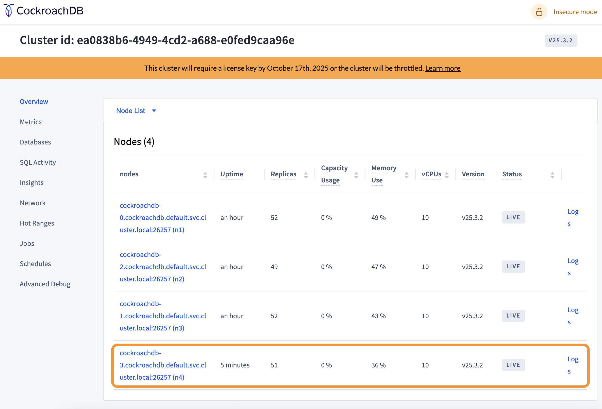
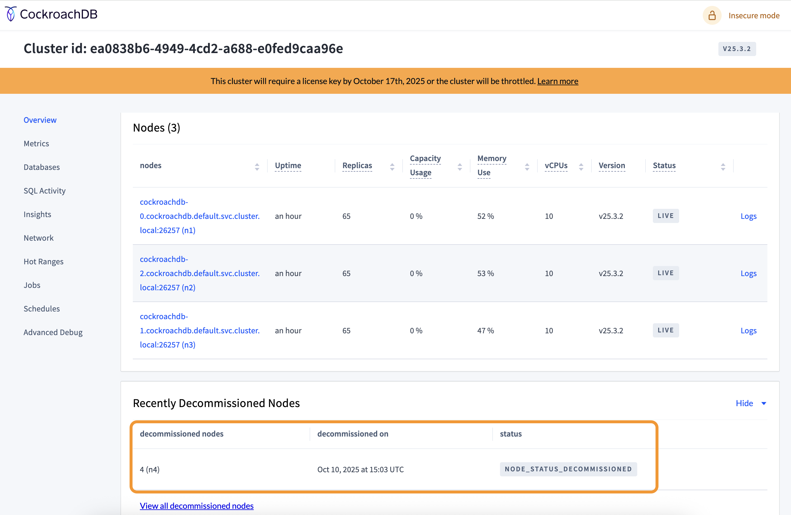
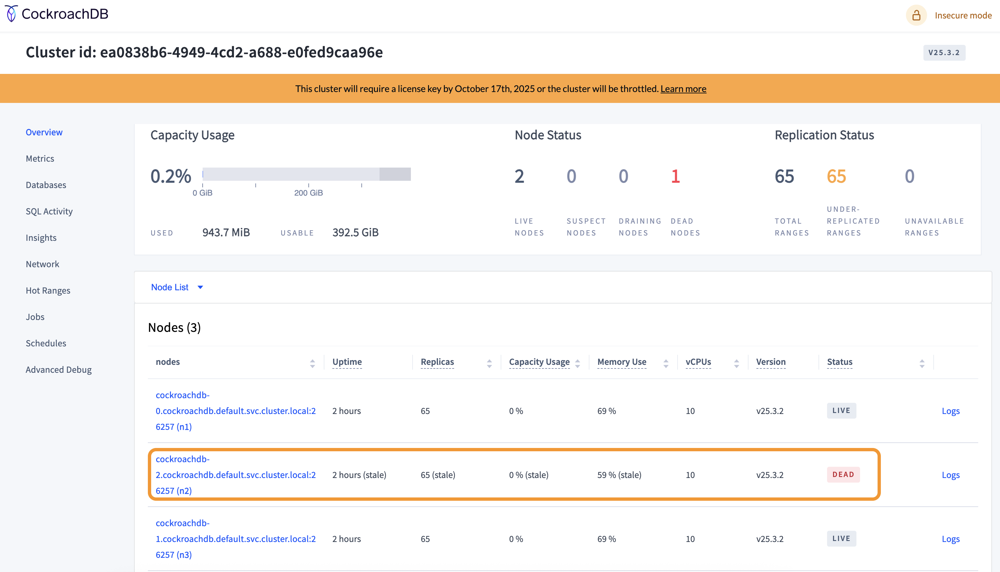
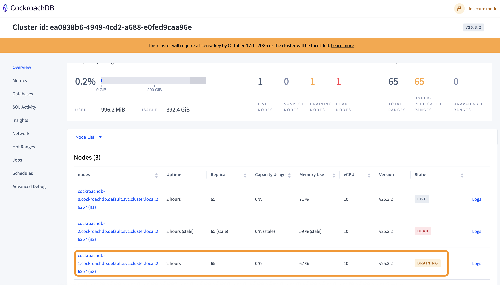

# Scaling and Failing

As part of this exercise, you will scale up and scale down your CockroachDB cluster with an active load and observe the way it behaves.

1. Update your CockroachDB cluster from 3 nodes to 4 nodes and observe for 5 minutes.

    ```bash
    kubectl scale statefulset cockroachdb --replicas=4
    ```

     ```bash
    ##Sample Output##
    statefulset.apps/cockroachdb scaled
    ```

    You will observe that the number of `replicas` get balanced evenly among all the nodes within 5 minutes of the new node spawning up.

    

1. Now gracefully remove the newly added node from the cluster and observe for 5 minutes.

    For this task, first you will run below command to check the node status for your CockroachDB cluster.

    ```bash
    cockroach node status --host=cockroachdb.example.com:26257 --insecure
    ```

    ```bash
     ##Sample Output##

       id |                          address                          |                        sql_address                        |  build  |              started_at              |              updated_at              | locality | attrs | is_available | is_live
     -----+-----------------------------------------------------------+-----------------------------------------------------------+---------+--------------------------------------+--------------------------------------+----------+-------+--------------+----------
        1 | cockroachdb-0.cockroachdb.default.svc.cluster.local:26257 | cockroachdb-0.cockroachdb.default.svc.cluster.local:26257 | v25.3.2 | 2025-10-10 03:03:45.372156 +0000 UTC | 2025-10-10 03:57:45.357952 +0000 UTC |          | []    | true         | true
        2 | cockroachdb-2.cockroachdb.default.svc.cluster.local:26257 | cockroachdb-2.cockroachdb.default.svc.cluster.local:26257 | v25.3.2 | 2025-10-10 03:36:33.870979 +0000 UTC | 2025-10-10 03:57:45.956039 +0000 UTC |          | []    | true         | true
        3 | cockroachdb-1.cockroachdb.default.svc.cluster.local:26257 | cockroachdb-1.cockroachdb.default.svc.cluster.local:26257 | v25.3.2 | 2025-10-10 03:36:33.604466 +0000 UTC | 2025-10-10 03:57:45.686746 +0000 UTC |          | []    | true         | true
        4 | cockroachdb-3.cockroachdb.default.svc.cluster.local:26257 | cockroachdb-3.cockroachdb.default.svc.cluster.local:26257 | v25.3.2 | 2025-10-10 03:24:39.978172 +0000 UTC | 2025-10-10 03:27:14.668713 +0000 UTC |          | []    | true         | true
    (4 rows)
    ```

    You will then remove node 4 (cockroachdb-3) from the cluster gracefully. To do that first you have to decommission node 4 by running below command

    ```bash
    cockroach node decommission 4 --host=cockroachdb.example.com:26257 --insecure
    ```

    ```bash
    ##Sample Output##

    id | is_live | replicas | is_decommissioning |   membership    | is_draining | readiness | blocking_ranges
    -----+---------+----------+--------------------+-----------------+-------------+-----------+------------------
    4 |  true   |       50 |        true        | decommissioning |    false    |   ready   |               0
    (1 row)
    ..
    id | is_live | replicas | is_decommissioning |   membership    | is_draining | readiness | blocking_ranges
    -----+---------+----------+--------------------+-----------------+-------------+-----------+------------------
    4 |  true   |       49 |        true        | decommissioning |    false    |   ready   |               0
    (1 row)
    ....
    id | is_live | replicas | is_decommissioning |   membership    | is_draining | readiness | blocking_ranges
    -----+---------+----------+--------------------+-----------------+-------------+-----------+------------------
    4 |  true   |       38 |        true        | decommissioning |    false    |   ready   |               0
    (1 row)
    .
    .
    .
    id | is_live | replicas | is_decommissioning |   membership    | is_draining | readiness | blocking_ranges
    -----+---------+----------+--------------------+-----------------+-------------+-----------+------------------
    4 |  true   |        1 |        true        | decommissioning |    false    |   ready   |               0
    (1 row)

    id | is_live | replicas | is_decommissioning |   membership    | is_draining | readiness | blocking_ranges
    -----+---------+----------+--------------------+-----------------+-------------+-----------+------------------
    4 |  true   |        0 |        true        | decommissioning |    false    |   ready   |               0
    (1 row)
    draining node n4
    node is draining... remaining: 65
    node is draining... remaining: 0 (complete)
    node n4 drained successfully

    No more data reported on target nodes. Please verify cluster health before removing the nodes.
    ```

    

    Once Node 4 has been `Decommissioned`, you can now scale down your Statefulset to 3 nodes by running below command

    ```bash
    kubectl scale sts cockroachdb --replicas=3
    ```

    ```bash
    ##Sample Output##

    statefulset.apps/cockroachdb scaled
    ```

1. Now remove 1 node forcefully and observe for 5 minutes.

    ```bash
    kubectl scale sts cockroachdb --replicas=2
    ```

    You will observe that the node which is deleted initially is marked as "Draining" and then it changes to "Suspect" status.

    

    In around 5 minutes, as the node still remains down, CockroachDB changes the node status from "Suspect" to "Dead".

    

1. Remove all nodes but one from the cluster.

    1. For this step first try to remove all nodes except one gracefully.

        ```bash
        cockroach node decommission 3 --host=cockroachdb.example.com:26257 --insecure
        ```

        ```bash
        ##Sample Output##

        id | is_live | replicas | is_decommissioning | membership | is_draining |     readiness     | blocking_ranges
        -----+---------+----------+--------------------+------------+-------------+-------------------+------------------
        3 |  true   |       65 |       false        |   active   |    false    | allocation errors |              65
        (1 row)

        ranges blocking decommission detected
        n3 has 65 replicas blocked with error: "0 of 1 live stores are able to take a new replica for the range (2 already have a voter, 0 already have a non-voter); likely not enough nodes in cluster"

        ERROR: Cannot decommission nodes.
        Failed running "node decommission"
        ```

        You will observe that you will not be allowed to decommission node3 as there are not enough nodes in the cluster to take on the replicas of node3.

    1. Now try remove all nodes except 1 forcefully.

        ```bash
        kubectl scale sts cockroachdb --replicas=1
        ```

        You will notice that node3 status would briefly changes to "Draining" before the Database stops serving any queries. You can validate this from the load generation terminal too. You would see your load generation tool would have stopped with errors.

        

        Load tool terminal output

        ```bash
         ##Sample Output##

        ...

        2632.0s        0            0.0          594.8      0.0      0.0      0.0      0.0 transfer
        2633.0s        0            0.0          594.6      0.0      0.0      0.0      0.0 transfer
        E251010 15:34:40.957687 1 workload/cli/run.go:590  [-] 4  workload run error: pq: result is ambiguous: replica unavailable: (n1,s1):1 unable to serve request to r84:/Table/111/1/{600-700} [(n1,s1):1, (n3,s3):5, (n2,s2):3, next=6, gen=32, sticky=9223372036.854775807,2147483647]: lost quorum (down: (n3,s3):5,(n2,s2):3); closed timestamp: 1760110417.669200006,0 (2025-10-10 15:33:37); raft status: {"id":"1","term":9,"vote":"1","commit":529893,"lead":"0","leadEpoch":"0","raftState":"StateFollower","applied":529893,"progress":{},"leadtransferee":"0"}: have been waiting 60.50s for slow proposal ResolveIntent [/Table/111/1/666/0], ResolveIntent [/Table/111/1/679/0], ResolveIntent [/Table/111/1/613/0], [max_span_request_keys: 0], [target_bytes: 4194304]
        E251010 15:34:40.957687 1 workload/cli/run.go:590  [-] 4 +(1) pq: result is ambiguous: replica unavailable: (n1,s1):1 unable to serve request to r84:/Table/111/1/{600-700} [(n1,s1):1, (n3,s3):5, (n2,s2):3, next=6, gen=32, sticky=9223372036.854775807,2147483647]: lost quorum (down: (n3,s3):5,(n2,s2):3); closed timestamp: 1760110417.669200006,0 (2025-10-10 15:33:37); raft status: {"id":"1","term":9,"vote":"1","commit":529893,"lead":"0","leadEpoch":"0","raftState":"StateFollower","applied":529893,"progress":{},"leadtransferee":"0"}: have been waiting 60.50s for slow proposal ResolveIntent [/Table/111/1/666/0], ResolveIntent [/Table/111/1/679/0], ResolveIntent [/Table/111/1/613/0], [max_span_request_keys: 0], [target_bytes: 4194304]
        E251010 15:34:40.957687 1 workload/cli/run.go:590  [-] 4 +Error types: (1) *pq.Error
        Error: pq: result is ambiguous: replica unavailable: (n1,s1):1 unable to serve request to r84:/Table/111/1/{600-700} [(n1,s1):1, (n3,s3):5, (n2,s2):3, next=6, gen=32, sticky=9223372036.854775807,2147483647]: lost quorum (down: (n3,s3):5,(n2,s2):3); closed timestamp: 1760110417.669200006,0 (2025-10-10 15:33:37); raft status: {"id":"1","term":9,"vote":"1","commit":529893,"lead":"0","leadEpoch":"0","raftState":"StateFollower","applied":529893,"progress":{},"leadtransferee":"0"}: have been waiting 60.50s for slow proposal ResolveIntent [/Table/111/1/666/0], ResolveIntent [/Table/111/1/679/0], ResolveIntent [/Table/111/1/613/0], [max_span_request_keys: 0], [target_bytes: 4194304]
        ```

## Key Observations:

1. As you were adding and removing nodes from the cluster, how did that impact performance?  What kinds of metrics were you tracking to identify that impact?

    The key thing that you will observe is as the 4th node gets added, CockroachDB automatically began rebalancing and evenly distributing replicas.

2. What other kinds of behaviour did you witness as you were changing the cluster topology?  How did the system handle the hard node failure differently than the graceful shutdown?

    With graceful shutdown, the node drains its replicas and connections before decommissioning where as with hard node failure the db marks the node as suspect hoping it would return back to normal state within a set duration (observed 5 mins) and if it doesn't then marks it dead. The replicas do not get drained in this scenario.

3. When you killed all of the nodes but one, what happened to the database?

    One of the key behaviour that I noticed is the cluster needs atleast 2 nodes to perform properly. If you try to decommission a node when only 2 nodes are live, it refuses to perform the action. If you forcefully do a hard node failure, the db stops functioning with a single node even though the pod is up.

4. Did the platform behave differently than you would expect in any of the above scenarios?  If so please describe.

    You may have expected the latency to have increased significantly as a new node spins up as the ranges needs to get replicated to the new node. But based on the observation, it was not the case. Another thing that you may have noticed is cockroachDB needs a minimum of 3 nodes to function as per the ideal expectation.

-------------

Navigate to ([Task4](./4_execute_code_example.md) | [Main Page](../README.md))